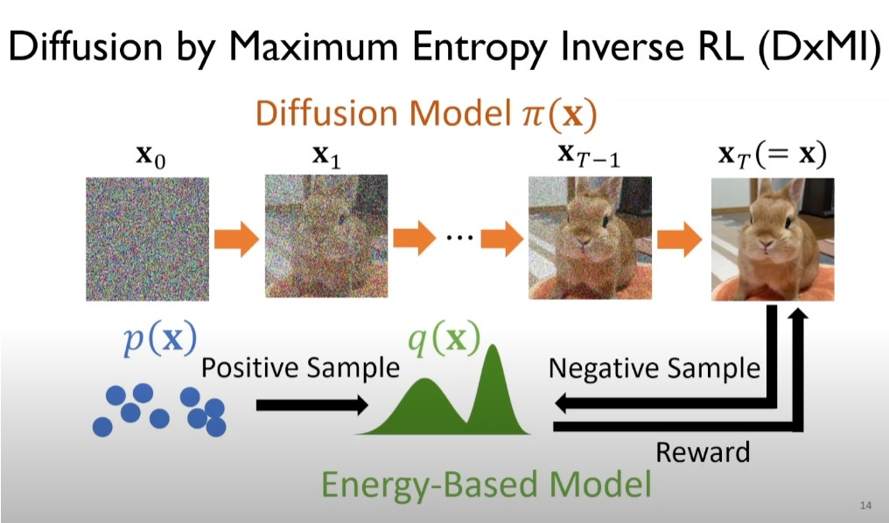
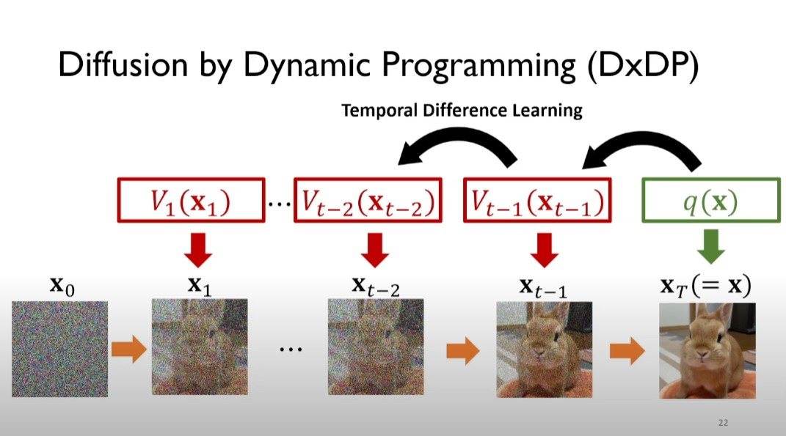
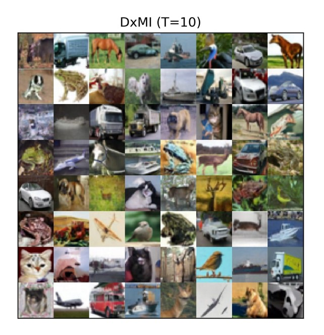

# Exploring DxMI: A Maximum Entropy IRL Approach for Diffusion Models

Diffusion models being a powerful tool in generative modeling, image generation and other tasks often face a critical challenge: slow generation speeds due to the need for thousands of iterative steps. In the paper [*"Maximum Entropy Inverse Reinforcement Learning of Diffusion Models with Energy-Based Models"*](https://arxiv.org/pdf/2407.00626) presented at NeurIPS 2024, Yoon et al. propose an innovative solution: Diffusion by Maximum Entropy IRL (DxMI). This framework leverages principles of inverse reinforcement learning (IRL) and energy-based models (EBMs) to improve the efficiency and quality of diffusion models. Here, we explore the training process in depth, highlighting how DxMI enhances traditional diffusion methods.

## The DxMI Training Process

### Overview of the Training Framework

DxMI frames the training of diffusion models as a minimax optimization problem. This involves two components working together:

1. **Diffusion Model (π(x))**: This model generates samples by progressively refining noise into realistic data. It is optimized to maximize the reward provided by the EBM while ensuring high sample entropy for diversity.
2. **Energy-Based Model (EBM)**: The EBM represents the log data density and acts as the reward function for the diffusion model. It is trained to approximate the data distribution while penalizing deviations caused by poorly generated samples.

The objective is to find an equilibrium where the diffusion model generates samples indistinguishable from the data distribution, and the EBM accurately evaluates the density of these samples.

#### Visual Representation of DxMI Workflow

Below is an illustration of the DxMI workflow:

**Figure :** *Top: Diffusion model optimizing transitions to maximize reward and entropy.
Bottom: Training data and EBM working together to estimate the reward.*

### Alternating Optimization

DxMI employs an alternating optimization approach:

1. **EBM Update**: The EBM parameters are updated to minimize the difference between the energy assigned to training data and generated samples. Regularization ensures stable training dynamics.
2. **Diffusion Model Update**: The diffusion model is trained to maximize the reward (log data density estimated by the EBM) while ensuring high entropy. This step uses the novel Diffusion by Dynamic Programming (DxDP) algorithm to address computational challenges.

### The Role of DxDP

Traditional diffusion training faces two main issues:

1. **Entropy Estimation**: Computing the marginal entropy of generated samples is infeasible in high dimensions.
2. **Backpropagation Through Time**: Propagating gradients across many diffusion steps leads to instability and excessive memory requirements.

#### How DxDP Works

DxDP solves these challenges by:

- **Replacing Marginal Entropy with Conditional Entropies**: Simplifying the computation while preserving the optimization objectives.
- **Introducing Value Functions**: These represent the expected future cost and are optimized iteratively, avoiding the need for full backpropagation through time.
- **Dynamic Programming Updates**: By breaking the optimization into smaller steps, DxDP ensures stable and efficient training.

A simplified schematic of DxDP is shown below:

 **Figure**: *Value functions guide the expected reward at each step.*

---

## Comparison with Traditional Diffusion Training

### Training Efficiency

Traditional diffusion models rely on behavioral cloning, where the model is trained to follow predefined diffusion trajectories over thousands of steps. This results in high computational costs and limits the ability to adapt to shorter trajectories.

In contrast, DxMI achieves competitive results with only 4 or 10 steps, reducing the computational burden significantly. For example:

- On CIFAR-10, DxMI achieves a Fréchet Inception Distance (FID) of 3.19 with 10 steps, compared to 13.36 for traditional methods like DDIM.
- On ImageNet 64×64, DxMI improves sample quality while requiring far fewer neural network evaluations.

### Stability and Robustness

The alternating optimization in DxMI stabilizes the joint training of diffusion models and EBMs. DxMI’s entropy maximization also ensures diverse and high-quality samples. Additionally, DxDP avoids the gradient explosion/vanishing issues prevalent in traditional training.

### Novel Capabilities

DxMI introduces capabilities not feasible with traditional methods:

- **Training EBMs Without MCMC**: The reliance on MCMC sampling for EBMs is replaced by the diffusion model, simplifying training and reducing sensitivity to hyperparameters.
- **Value Guidance**: The trained value function can guide sample generation, further improving quality metrics like FID and recall.

---

## Experiment Highlights

### Image Generation

DxMI was tested on various datasets, including CIFAR-10, ImageNet, and LSUN. Key results include:

- Generating high-quality samples in as few as 4 steps.
- Outperforming traditional diffusion models and competing methods like SFT-PG in both sample quality and computational efficiency.

Below is an example of CIFAR-10 samples generated in 10 steps using DxMI:

### Anomaly Detection

On the MVTec-AD dataset, DxMI-trained EBMs achieved state-of-the-art results in detecting and localizing anomalies. This demonstrates the versatility of DxMI in tasks beyond generative modeling.

### Ablation Studies

The authors conducted extensive ablation studies to evaluate the impact of key components, such as entropy regularization and pretraining. These studies revealed:

- Entropy regularization significantly improves sample diversity and alignment with the data distribution.
- Pretraining diffusion models as DDPMs provides a useful initialization but is not strictly necessary.

---

## Reflections on the DxMI Training Process

DxMI represents a paradigm shift in training diffusion models. By integrating IRL principles, EBMs, and dynamic programming, it addresses longstanding challenges in generative modeling. The efficiency gains and stability improvements make it a promising alternative to traditional methods, with broad applicability in machine learning and beyond.

For those interested in exploring DxMI further, the code is available [here](https://github.com/swyoon/Diffusion-by-MaxEntIRL.git).

